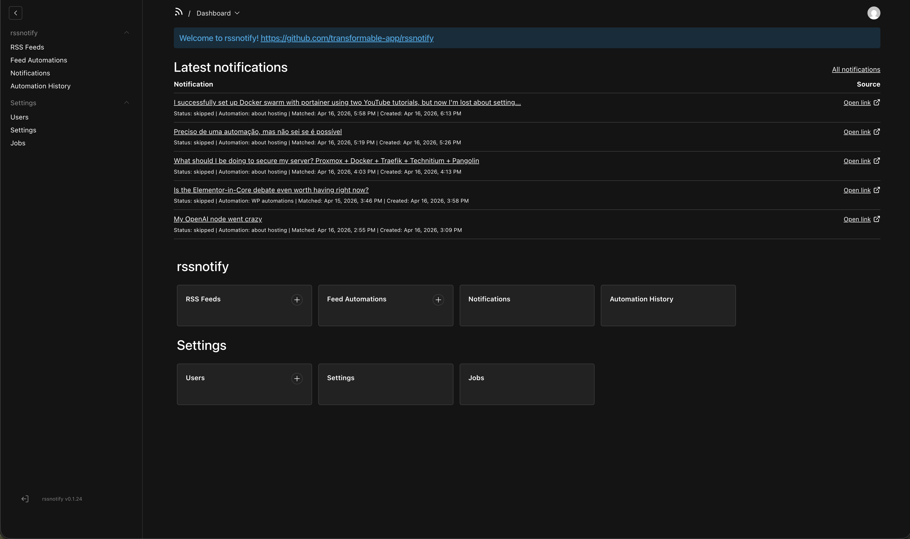
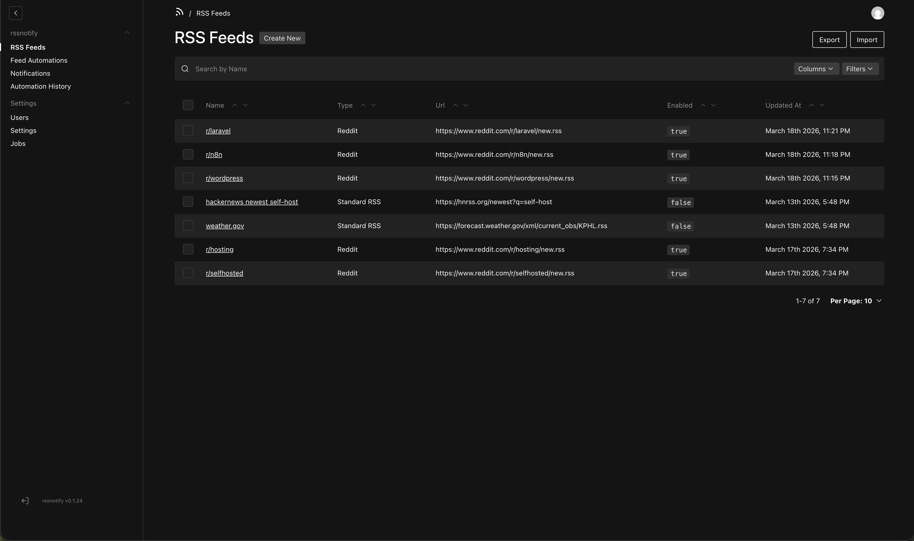
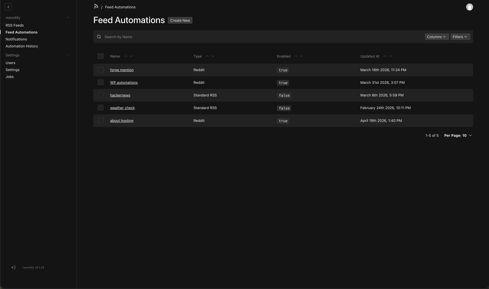
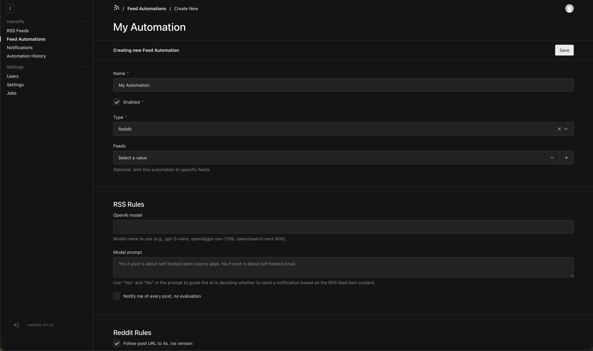
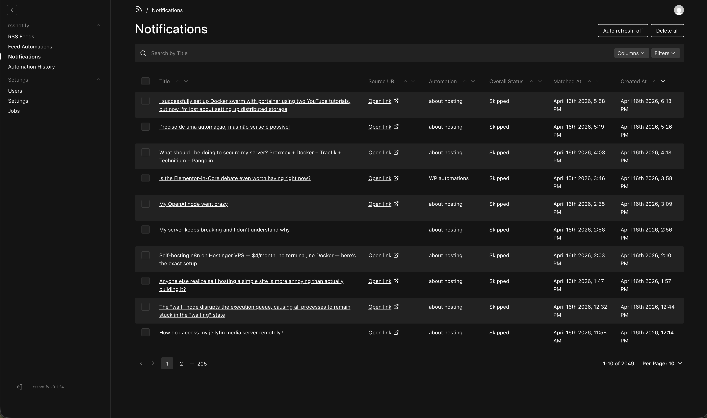
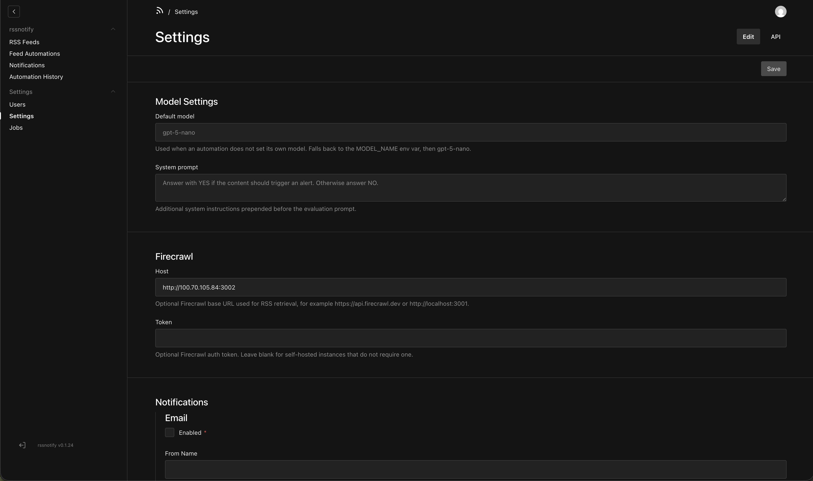

# rssnotify

RSS feed monitor that evaluates feed items with OpenAI API compatible models, creates notifications when content matches your rules, and delivers them via email and/or [ntfy](https://ntfy.sh).

Built with [Payload CMS](https://payloadcms.com)

## Features

- **RSS Feeds** – Add Standard RSS, Reddit, or WordPress feed URLs; enable/disable per feed.
- **Feed Automations** – Define rules per automation: optional OpenAI-based filtering, “notify every post,” and type-specific options (e.g. follow post RSS, process comments for Reddit/WordPress).
- **Notifications** – View and manage generated alerts; delivery status (email / ntfy) and bulk actions in the admin.
- **Digests** – Send scheduled email summaries of notifications, optionally summarized and prioritized with AI.
- **Result Feeds** – Publish public or token-protected Atom/RSS feeds of notification and digest results.
- **Scheduled jobs** – Process feeds and deliver notifications on a cron schedule.
- **Notification delivery** – Email (SMTP) and/or ntfy; configurable in Settings.

## Screenshots

| Dashboard                                       | RSS Feeds                                      |
| ----------------------------------------------- | ---------------------------------------------- |
|  |  |

| Feed Automations                                         | Create Automation                                              |
| -------------------------------------------------------- | -------------------------------------------------------------- |
|  |  |

| Notifications                                           | Settings                                      |
| ------------------------------------------------------- | --------------------------------------------- |
|  |  |

## Quick Start

1. Clone the repo and create a `.env` in the project root. Set at least:
   - `PAYLOAD_SECRET` – secret for Payload (required)
   - `NEXT_PUBLIC_SERVER_URL` – public URL of the app (e.g. `http://localhost:3000`)
   - `CRON_SECRET` – secret for cron/job endpoints (required)
   - `PREVIEW_SECRET` – secret for preview (required)
   - Optionally: `OPENAI_API_KEY` (and `OPENAI_BASE_URL`, `OPENAI_FALLBACK_BASE_URLS`, `MODEL_NAME`) for AI filtering and digest summarization. MongoDB credentials default in Compose; override with `MONGO_INITDB_ROOT_USERNAME`, `MONGO_INITDB_ROOT_PASSWORD`, `MONGO_INITDB_DATABASE` if needed.
2. Start the stack with Docker Compose using this project’s [docker-compose.yml](docker-compose.yml):
   ```bash
   docker-compose up
   ```
3. Open `http://localhost:3000/admin`, create an admin user, then add **RSS Feeds** and **Feed Automations**.

## Collections

All content is restricted to authenticated users.

### RSS Feeds

Feed sources to poll.

- **Name** – Label for the feed.
- **Type** – `Standard RSS`, `Reddit`, or `WordPress`.
- **URL** – Feed URL (unique).
- **Enabled** – Whether the feed is included in processing.
- **Notes** – Optional notes.

### Feed Automations

Rules that run when processing feeds. Each automation can target all feeds or a selected set.

- **Name** – Label for the automation.
- **Enabled** – Whether the automation runs.
- **Type** – `Standard RSS`, `Reddit`, or `WordPress / Blog`.
- **Feeds** – Optional: limit this automation to specific feeds.
- **RSS Rules** (shared) – OpenAI model and prompt for evaluating content; option to notify on every post without evaluation.
- **Reddit Rules** (when type = Reddit) – Follow post URL to its `.rss` version; process each comment.
- **WordPress / Blog RSS Rules** (when type = WordPress) – Same options as Reddit.

When content matches an automation’s rules, a **Notification** is created. The **process-feeds** job runs on a schedule to fetch feeds and evaluate items.

### Notifications

Generated alerts from feed automations.

- **Title**, **Message**, **Source URL** – Content and link.
- **Automation** – Which feed automation created it.
- **Feed** – Source feed (if known).
- **Matched At** – When the match occurred.
- **Overall Status** – `pending`, `sent`, `failed`, `skipped`.
- **Delivery** – Per-channel status and errors for **email** and **ntfy** (e.g. sent at, error message).
- **Data** – Raw payload for debugging.

The **deliver-notifications** job sends pending notifications using **Settings** (email and ntfy configuration).

### Digests

Scheduled email summaries of generated notifications.

- **Name** – Label for the digest.
- **Enabled** – Whether the digest runs.
- **Schedule** – Daily send time and timezone.
- **Recipient overrides** – Optional per-digest email recipients. When empty, the digest uses Settings email recipients.
- **Automations / Feeds** – Optional filters for which notifications are included.
- **Lookback hours** – How far back to look when a digest has not run before.
- **Max notifications** – Cap on included notifications.
- **Use AI summary and priority** – Uses the configured OpenAI-compatible model to summarize and order notifications.
- **Digest instructions / Priority instructions** – Extra prompt instructions for summary style and ranking behavior.

Digest email item links always use each notification’s **Source URL**. Digest delivery is audited through **Digest Runs**.

### Digest Runs

Audit records for digest delivery attempts.

- **Digest** – Which digest generated the run.
- **Run Key** – Dedupe key for a digest window.
- **Status** – `pending`, `sent`, `failed`, or `skipped`.
- **Window Start / Window End** – Notification window included in the run.
- **Notifications** – Included notifications.
- **Subject, Text, HTML** – Stored email output.
- **AI Output** – Stored structured model response when AI was used.
- **Error** – Delivery or AI fallback error detail.

### Result Feeds

Public or private Atom/RSS output feeds of generated results.

- **Name** – Label for the feed.
- **Enabled** – Whether the feed URL can be served.
- **Result Type** – `Notifications` or `Digests`.
- **Visibility** – `Private` requires the feed token; `Public` is visible to anyone with the URL.
- **Token** – Secret token accepted as `?token=<token>` or `Authorization: Bearer <token>` for private feeds.
- **Format** – Default format for `/feed.xml`; explicit `/feed.atom` and `/feed.rss` are also available.
- **Limit** – Maximum entries to include.
- **Automations / Feeds / Digests** – Optional filters for which results are included.
- **Statuses** – Optional status filter. When empty, feeds default to sent results.
- **Include Content** – Includes notification messages or digest summaries in entries.

Feed URLs:

- `/api/result-feeds/:id/feed.xml`
- `/api/result-feeds/:id/feed.atom`
- `/api/result-feeds/:id/feed.rss`

Notification result entries link to each notification’s **Source URL**.

### Users

Admin users (auth collection). Used for login and access control. Managed under **Settings** in the admin.

## Globals

### Settings (`settings`)

Configure feed processing and notification delivery.

- **Model Settings** – Default model, system prompt, and optional OpenAI-compatible fallback endpoints used when an automation does not override them. Fallback endpoints configured here override `OPENAI_FALLBACK_BASE_URLS` and can each use a different API key.
- **Firecrawl** – Optional host/token for RSS retrieval. If Firecrawl is not configured, rssnotify keeps using the existing direct fetch approach. Leave the token blank for self-hosted instances that do not require authentication.
- **Email** – Enabled, From Name, From Email, Reply-To, Recipients (list of addresses). Used with SMTP (e.g. Nodemailer); ensure your deployment has SMTP env vars configured if you use email.
- **Ntfy** – Enabled, Server URL (e.g. `https://ntfy.sh`), Auth Token (optional), Channels (list of topics).

### Jobs (`jobs`)

Global that shows the job schedule and queue status. Used by the **process-feeds** and **deliver-notifications** tasks.

## Access control

- **RSS Feeds, Feed Automations, Notifications, Result Feeds, Users** – Only authenticated users can create, read, update, and delete.
- **Settings, Jobs** – Only authenticated users can read and update.

## Jobs and schedule

- **process-feeds** – Fetches RSS/Reddit/WordPress feeds, evaluates items with automations (and optionally OpenAI), creates notifications. Runs every 15 minutes by default (`*/15 * * * *`) and can be overridden with `PROCESS_FEEDS_CRON` (e.g. `0 0 * * *` for hourly).
- **deliver-notifications** – Sends pending notifications via email and/or ntfy using Notification Settings. Runs every minute by default (`0 * * * * *`) and can be overridden with `DELIVER_NOTIFICATIONS_CRON`.
- **send-digests** – Checks for due digests and sends scheduled email summaries. Runs every minute by default (`0 * * * * *`) and can be overridden with `SEND_DIGESTS_CRON`.

Job execution is allowed for logged-in users or when the request includes the correct `CRON_SECRET` (e.g. for external cron or Vercel Cron).

When using the external script `./scripts/run-payload-jobs-every-minute.sh`, it waits until past the next minute then runs jobs so scheduled tasks (with `waitUntil` set to the next cron tick) actually execute.

## Development

- `pnpm dev` – Start Next.js dev server (Payload admin at `/admin`).
- `pnpm build` – Production build.
- `pnpm start` – Run production server.
- `pnpm generate:types` – Regenerate Payload types after schema changes.
- `pnpm generate:importmap` – Regenerate import map after adding/changing admin components.

Use a local MongoDB instance or Docker for `DATABASE_URL`. Optional: set `OPENAI_API_KEY` (and related env) to test AI-based filtering.

### OpenAI-compatible endpoints

AI filtering and digest summarization use OpenAI chat-completions compatible endpoints.

- `OPENAI_BASE_URL` sets the primary provider base URL. Defaults to `https://api.openai.com`.
- `OPENAI_FALLBACK_BASE_URLS` is an optional comma-separated list of alternate provider base URLs to try when the primary endpoint has a transport, timeout, rate-limit, or service failure.
- Settings > Model Settings can define fallback endpoints with a base URL and API key for each provider. When any admin fallback endpoint is configured, that list overrides `OPENAI_FALLBACK_BASE_URLS`.
- Env-configured fallback URLs reuse `OPENAI_API_KEY`; admin-configured fallback endpoints use their own saved API keys.

Example:

```env
OPENAI_BASE_URL=https://api.openai.com
OPENAI_FALLBACK_BASE_URLS=https://router-a.example.com,https://router-b.example.com
```

## Docker

### Run with Docker Compose

The repo includes a production Compose setup that runs the app and MongoDB:

1. Set required env (e.g. in `.env`): `PAYLOAD_SECRET`, `NEXT_PUBLIC_SERVER_URL`, `CRON_SECRET`, `PREVIEW_SECRET`. Optionally: `OPENAI_API_KEY`, `OPENAI_BASE_URL`, `OPENAI_FALLBACK_BASE_URLS`, `MODEL_NAME`, MongoDB credentials, `RSS_FETCH_JITTER_*`.
2. Run:
   ```bash
   docker-compose up
   ```
3. Open `http://localhost:3000/admin` and create your first user.

The app image is built from the project Dockerfile; Compose uses `ghcr.io/transformable-app/rssnotify:latest` by default (override with `RSSNOTIFY_IMAGE`).

### Docker deployment (GHCR)

Images are published to GitHub Container Registry:

- `ghcr.io/transformable-app/rssnotify`

#### Run the published image

```bash
docker run --rm -p 3000:3000 \
  -e DATABASE_URL='mongodb://<host>/rssnotify' \
  -e PAYLOAD_SECRET='<secret>' \
  -e NEXT_PUBLIC_SERVER_URL='https://your-domain.example' \
  -e CRON_SECRET='<cron-secret>' \
  -e PREVIEW_SECRET='<preview-secret>' \
  ghcr.io/transformable-app/rssnotify:latest
```

#### Cron jobs in Docker

Payload job schedules are driven by `jobs.autoRun`. The image uses:

- `PAYLOAD_JOBS_AUTORUN=true`
- `PAYLOAD_JOBS_AUTORUN_CRON=* * * * *`

Task defaults:

- `PROCESS_FEEDS_CRON=*/15 * * * *` (every 15 minutes; use e.g. `0 0 * * *` for hourly)
- `DELIVER_NOTIFICATIONS_CRON=0 * * * * *`
- `SEND_DIGESTS_CRON=0 * * * * *`

Override `PAYLOAD_JOBS_AUTORUN_CRON`, `PROCESS_FEEDS_CRON`, `DELIVER_NOTIFICATIONS_CRON`, and `SEND_DIGESTS_CRON` at runtime as needed. For multiple replicas, enable autoRun on a single instance to avoid duplicate processing.

## Production

1. Set `DATABASE_URL`, `PAYLOAD_SECRET`, `NEXT_PUBLIC_SERVER_URL`, and any cron/delivery/env required by your deployment.
2. Build and start: `pnpm build && pnpm start` (or use the Docker image).
3. For cron, either rely on in-process `PAYLOAD_JOBS_AUTORUN` or call the jobs endpoint on a schedule with `CRON_SECRET` in the `Authorization: Bearer <CRON_SECRET>` header.

## Platform Questions

For Payload CMS: [Discord](https://discord.com/invite/payload) or [GitHub discussions](https://github.com/payloadcms/payload/discussions).
